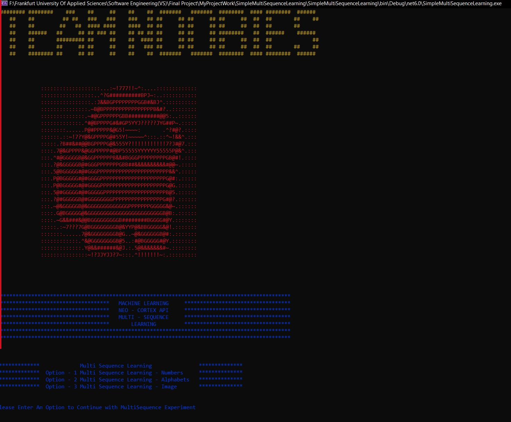
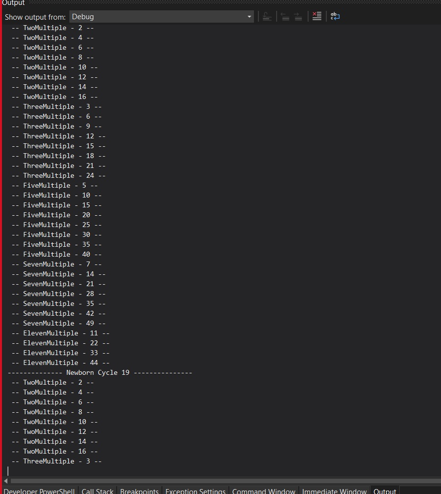
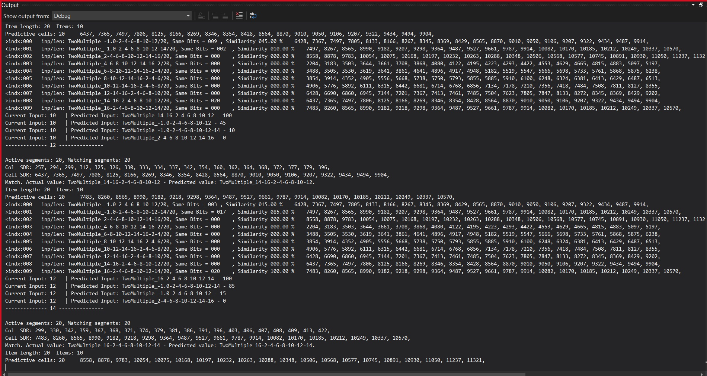
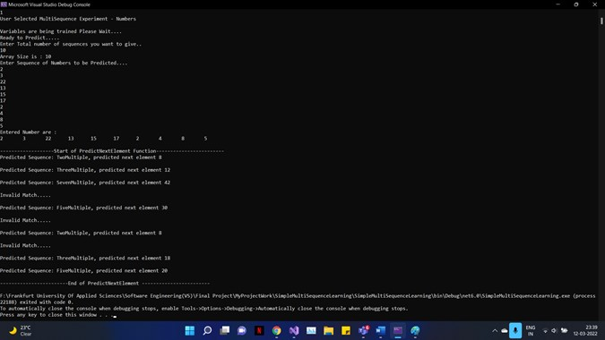
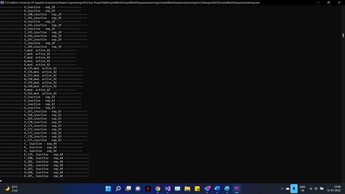
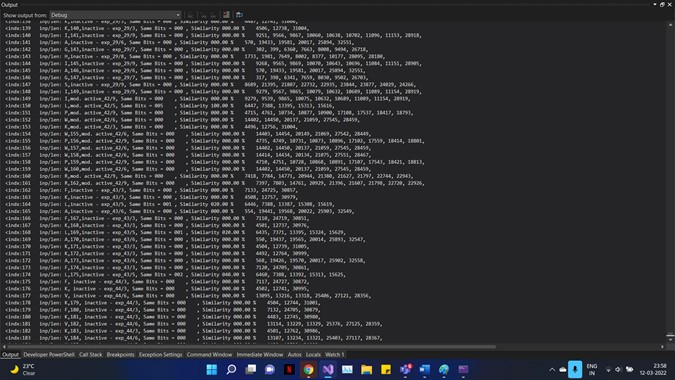
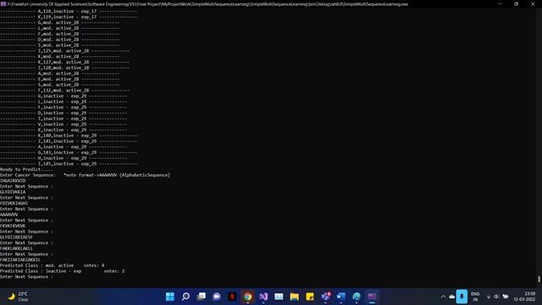
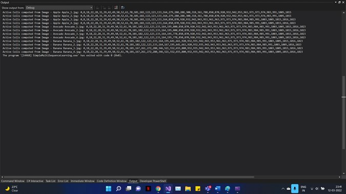

# 25. Multi-Sequence/Image Learning Project (WS21/22) Project - Team Noobies


Group Name: Team Noobies

 **Team Members**
- Harish Palanivel, 1392283 (harish.palanivel@stud.fra-uas.de)
- Gaurav Honnavara Manjunath, 1384178 (gaurav.honnavaramanjunath@stud.fra-uas.de)
- Athkar Praveen Prajwal, 1394663 (praveen.athkar@stud.fra-uas.de)


**Project Description**
=============


1.Objective
-------------

To demonstrate learning of sequences such as set of Number sequences, Alphabets (Cancer Cells Sequences) and Image Data Sets (Apple, Avocado, Banana)


In the previous work, Multi Sequence Learning solution has been implemented for Sequence of Numbers . Our task is to analyse and understand the solution and Develop the MultiSequence Learning Solution for Set of Alphabets (Cancer Cell Sequences) and MultiSequence Learning Solution for Image Data Sets

For Example :
After Training Data Sets, if the user inputs an image such as apple or orange, it has to predict which fruit is identified.


2.Approach
-------------

In the following Approaches, we introduce different types of Encoders in HtmPredictionEngine such as ScalarEncoder, HTM Image Encoder  for Learning Sequence of Numbers,Learning of Sequence of Alphabets and Image Data Sets.

The learning process includes: 
1. Reading sequences.
2. Encoding data using encoders.
3. Spatial Pooler Learning with Homeostatic Plasticity Controller until reaching a stable state.
4. Learning with Spatial pooler and Temporal memory, conditional exit.
5. Interactive testing section, output classification/prediction from input data.

- **Multi Sequence Learning -Numbers.**

In This Approach, by making use of MultiSequence Learning Solution, we analysed how multisequence prediction algorithm works, with the existing solution we tried to modifiy the code by changing various parameters such as different sequence of numbers that were allowed to train, and the user can input the sequence of numbers that needs to be predicted.
Also, we tried to change Configurations in HTM Prediction Engine.

Example Datarow :

```csharp
sequences.Add("TwoMultiple", new List<double>(new double[] { 2.0, 4.0, 6.0, 8.0, 10.0, 12.0, 14.0, 16.0 }));
            sequences.Add("ThreeMultiple", new List<double>(new double[] { 3.0, 6.0, 9.0, 12.0, 15.0, 18.0, 21.0, 24.0 }));
            sequences.Add("FiveMultiple", new List<double>(new double[] { 5.0, 10.0, 15.0, 20.0, 25.0, 30.0, 35.0, 40.0 }));
            sequences.Add("SevenMultiple", new List<double>(new double[] { 7.0, 14.0, 21.0, 28.0, 35.0, 42.0, 49.0 }));
            sequences.Add("ElevenMultiple", new List<double>(new double[] { 11.0, 22.0, 33.0, 44.0 }));
```


###### **DataFormat - [Number Sequence] -> [Sequence Class] Sequences - Multi Sequence **

- **Multi Sequence Learning -Alphabets.**

After we analysed MultiSequence Learning for Sequence of Numbers, we moved further to Train and Predict Sequence of Alphabet.
In This Approach, the sequence of alphabets were stored in .csv file and identified those sequences with different labels. The Solution was modified to read these sequence of Alphabets from .csv file and Train Alphabets by making use of AlphabetsEncoder and HTM Prediction Algoritm.

Example Alphabet Sequence : 

`FAKALKALLKALKAL,inactive - exp_8
FAKKLAKKLKKLAKKLAKKWKL,mod. active_18
FAKIIAKIAKIAKKIL,inactive - exp_10
FAKKALKALKKL,inactive - exp_11
FAKKFAKKFKKFAKKFAKFAFAF,mod. active_12
FAKKLAKKLAKLL,mod. active_16
FAKKLAKKLKKLAKKLAK,inactive - exp_17
GLFDIIKKIAESF,mod. active_28
GLFDIVKKIAGHIAGSI,inactive - exp_29
ILPWKWPWWPWRR,mod. active_42
FKLAFKLAKKAFL,inactive - exp_43
FKVKFKVKVK, inactive - exp_44`


###### **[Alphabetic Sequence] -> [Sequence Class] Sequences - Multi Sequence**


- **Multi Sequence Learning -Image Data Sets.**

After we analysed MultiSequence Learning for Sequence of Alphabets, we moved further to Train and Predict Image DataSets.
In This Approach, the Image Data Sets are stored in local folder with subfolders categories as labels.
Code is developed to binarize the image data sets and store in the local directory, also the sequence of image data sets that needs to be given to the HTM Prediction Engine
is being modified with the help of Image Encoder.

###### **[Image Data Sets] -> [Image Data Set Class] Sequences - Multi Sequence**


 3.Learning Process
-------------

#### 1.Multi Sequence Learning -Numbers.

(i) Input sequence of Numbers to Train Model

```csharp
sequences.Add("TwoMultiple", new List<double>(new double[] { 2.0, 4.0, 6.0, 8.0, 10.0, 12.0, 14.0, 16.0 }));
sequences.Add("ThreeMultiple", new List<double>(new double[] { 3.0, 6.0, 9.0, 12.0, 15.0, 18.0, 21.0, 24.0 }));
sequences.Add("FiveMultiple", new List<double>(new double[] { 5.0, 10.0, 15.0, 20.0, 25.0, 30.0, 35.0, 40.0 }));
sequences.Add("SevenMultiple", new List<double>(new double[] { 7.0, 14.0, 21.0, 28.0, 35.0, 42.0, 49.0 }));
sequences.Add("ElevenMultiple", new List<double>(new double[] { 11.0, 22.0, 33.0, 44.0 }));
```

(ii) Set Parameters in HTM Configuration and Train Sequence using Scalar Encoder (Which includes Stablity using HomeostaticPlasticityController)


```csharp            
HtmConfig cfg = new HtmConfig(new int[] { inputBits }, new int[] { numColumns })
{
                Random = new ThreadSafeRandom(42),

                CellsPerColumn = 25,
                GlobalInhibition = true,
                LocalAreaDensity = -1,
                NumActiveColumnsPerInhArea = 0.02 * numColumns,
                PotentialRadius = (int)(0.15 * inputBits),
                //InhibitionRadius = 15,

                MaxBoost = 10.0,
                DutyCyclePeriod = 25,
                MinPctOverlapDutyCycles = 0.75,
                MaxSynapsesPerSegment = (int)(0.02 * numColumns),

                ActivationThreshold = 15,
                ConnectedPermanence = 0.5,

                // Learning is slower than forgetting in this case.
                PermanenceDecrement = 0.25,
                PermanenceIncrement = 0.15,

                // Used by punishing of segments.
                PredictedSegmentDecrement = 0.1
};
```


```csharp
EncoderBase encoder = new ScalarEncoder(settings);

RunExperiment(inputBits, cfg, encoder, sequences);
```






#### 2.Multi Sequence Learning -Alphabets.

(i) Input sequence of Alphabets from .csv File to Train Model

`FAKALKALLKALKAL,inactive - exp_8
FAKKLAKKLKKLAKKLAKKWKL,mod. active_18
FAKIIAKIAKIAKKIL,inactive - exp_10
FAKKALKALKKL,inactive - exp_11
FAKKFAKKFKKFAKKFAKFAFAF,mod. active_12
FAKKLAKKLAKLL,mod. active_16
FAKKLAKKLKKLAKKLAK,inactive - exp_17
GLFDIIKKIAESF,mod. active_28
GLFDIVKKIAGHIAGSI,inactive - exp_29
ILPWKWPWWPWRR,mod. active_42
FKLAFKLAKKAFL,inactive - exp_43
FKVKFKVKVK, inactive - exp_44`

```csharp        
public static List<Dictionary<string, string>> ReadSequencesDataFromCSV(string dataFilePath)
        {
            List<Dictionary<string, string>> SequencesCollection = new List<Dictionary<string, string>>();

            int keyForUniqueIndexes = 0;

            if (File.Exists(dataFilePath))
            {
                using (StreamReader sr = new StreamReader(dataFilePath))
                {
                    while (sr.Peek() >= 0)
                    {
                        var line = sr.ReadLine();
                        string[] values = line.Split(",");

                        Dictionary<string, string> Sequence = new Dictionary<string, string>();

                        string label = values[1];
                        string sequenceString = values[0];

                        foreach (var alphabet in sequenceString)
                        {
                            keyForUniqueIndexes++;
                            if (Sequence.ContainsKey(alphabet.ToString()))
                            {
                                var newKey = alphabet.ToString() + "," + keyForUniqueIndexes;
                                Sequence.Add(newKey, label);
                            }
                            else
                            {
                                Sequence.Add(alphabet.ToString(), label);
                            }
                        }

                        SequencesCollection.Add(Sequence);
                    }
                }
                return SequencesCollection;
            }
            return null;
        }
```

```csharp
        public static List<Dictionary<string, int[]>> TrainEncodeSequencesFromCSV(List<Dictionary<string, string>> trainingData)
        {
            List<Dictionary<string, int[]>> ListOfEncodedTrainingSDR = new List<Dictionary<string, int[]>>();

            ScalarEncoder encoder_Alphabets = FetchAlphabetEncoder();

            foreach (var sequence in trainingData)
            {
                int keyForUniqueIndex = 0;
                var tempDictionary = new Dictionary<string, int[]>();

                foreach (var element in sequence)
                {
                    keyForUniqueIndex++;
                    var elementLabel = element.Key + "," + element.Value;
                    var elementKey = element.Key;
                    int[] sdr = new int[0];
                    sdr = sdr.Concat(encoder_Alphabets.Encode(char.ToUpper(element.Key.ElementAt(0)) - 64)).ToArray();

                    if (tempDictionary.ContainsKey(elementLabel))
                    {
                        var newKey = elementLabel + "," + keyForUniqueIndex;
                        tempDictionary.Add(newKey, sdr);
                    }
                    else
                    {
                        tempDictionary.Add(elementLabel, sdr);
                    }
                }
                ListOfEncodedTrainingSDR.Add(tempDictionary);
            }
            return ListOfEncodedTrainingSDR;
        }
```

(ii) Set Parameters in HTM Configuration and Train Sequence using FetchAlphabetEncoder (Which includes Stablity using HomeostaticPlasticityController)


```csharp
            HtmConfig cfg = new HtmConfig(new int[] { inputBits_Alpha }, new int[] { numColumns_Alpha })
            {
                Random = new ThreadSafeRandom(42),

                CellsPerColumn = 32,
                GlobalInhibition = true,
                LocalAreaDensity = -1,
                NumActiveColumnsPerInhArea = 0.02 * numColumns_Alpha,
                PotentialRadius = 65/*(int)(0.15 * inputBits_Alpha)*/,
                InhibitionRadius = 15,

                MaxBoost = 10.0,
                DutyCyclePeriod = 25,
                MinPctOverlapDutyCycles = 0.75,
                MaxSynapsesPerSegment = 128/*(int)(0.02 * numColumns_Alpha)*/,

                ActivationThreshold = 15,
                ConnectedPermanence = 0.5,

                // Learning is slower than forgetting in this case.
                PermanenceDecrement = 0.25,
                PermanenceIncrement = 0.15,

                // Used by punishing of segments.
                PredictedSegmentDecrement = 0.1
            };
```


```csharp
public Dictionary<CortexLayer<object, object>, HtmClassifier<string, ComputeCycle>> RunAlphabetsLearning(List<Dictionary<string, int[]>> Sequences, Boolean classVotingEnabled)
        {
            int inputBits_Alpha = 31;
            int maxCycles = 30;
            int numColumns_Alpha = 1024;

            HtmConfig cfg = new HtmConfig(new int[] { inputBits_Alpha }, new int[] { numColumns_Alpha })
            {
                Random = new ThreadSafeRandom(42),

                CellsPerColumn = 32,
                GlobalInhibition = true,
                LocalAreaDensity = -1,
                NumActiveColumnsPerInhArea = 0.02 * numColumns_Alpha,
                PotentialRadius = 65/*(int)(0.15 * inputBits_Alpha)*/,
                InhibitionRadius = 15,

                MaxBoost = 10.0,
                DutyCyclePeriod = 25,
                MinPctOverlapDutyCycles = 0.75,
                MaxSynapsesPerSegment = 128/*(int)(0.02 * numColumns_Alpha)*/,

                ActivationThreshold = 15,
                ConnectedPermanence = 0.5,

                // Learning is slower than forgetting in this case.
                PermanenceDecrement = 0.25,
                PermanenceIncrement = 0.15,

                // Used by punishing of segments.
                PredictedSegmentDecrement = 0.1
            };

            //--------- CONNECTIONS
            var mem = new Connections(cfg);

            // HTM CLASSIFIER
            HtmClassifier<string, ComputeCycle> cls = new HtmClassifier<string, ComputeCycle>();
            // CORTEX LAYER
            CortexLayer<object, object> layer1 = new CortexLayer<object, object>("L1");


            // HPA IS_IN_STABLE STATE FLAG
            bool isInStableState = false;
            // LEARNING ACTIVATION FLAG
            bool learn = true;

            // NUMBER OF NEW BORN CYCLES
            int newbornCycle = 0;

            // HOMOSTATICPLASTICITY CONTROLLER
            HomeostaticPlasticityController hpa = new HomeostaticPlasticityController(mem, Sequences.Count, (isStable, numPatterns, actColAvg, seenInputs) =>
            {
                if (isStable)
                    // Event should be fired when entering the stable state.
                    Debug.WriteLine($"STABLE: Patterns: {numPatterns}, Inputs: {seenInputs}, iteration: {seenInputs / numPatterns}");
                else
                    // Ideal SP should never enter unstable state after stable state.
                    Debug.WriteLine($"INSTABLE: Patterns: {numPatterns}, Inputs: {seenInputs}, iteration: {seenInputs / numPatterns}");

                // We are not learning in instable state.
                learn = isInStableState = isStable;

                // Clear all learned patterns in the classifier.
                //cls.ClearState();

            }, numOfCyclesToWaitOnChange: 30);

            // SPATIAL POOLER initialization with HomoPlassiticityController using connections.
            SpatialPoolerMT sp = new SpatialPoolerMT(hpa);
            sp.Init(mem);

            // TEMPORAL MEMORY initialization using connections.
            TemporalMemory tm = new TemporalMemory();
            tm.Init(mem);

            // ADDING SPATIAL POOLER TO CORTEX LAYER
            layer1.HtmModules.Add("sp", sp);

            // CONTRAINER FOR Previous Active Columns
            int[] prevActiveCols = new int[0];

            // Starting experiment
            Stopwatch sw = new Stopwatch();
            sw.Start();

            // TRAINING SP till STATBLE STATE IS ACHIEVED
            while (isInStableState == false) // STABLE CONDITION LOOP ::: LOOP - 0
            {
                newbornCycle++;
                Debug.WriteLine($"-------------- Newborn Cycle {newbornCycle} ---------------");

                foreach (var sequence in Sequences) // FOR EACH SEQUENCE IN SEQUNECS LOOP ::: LOOP - 1
                {
                    foreach (var Element in sequence) // FOR EACH dictionary containing single sequence Details LOOP ::: LOOP - 2
                    {
                        var observationClass = Element.Key; // OBSERVATION LABEL || SEQUENCE LABEL
                        var elementSDR = Element.Value; // ALL ELEMENT IN ONE SEQUENCE 

                        Console.WriteLine($"-------------- {observationClass} ---------------");
                        // CORTEX LAYER OUTPUT with elementSDR as INPUT and LEARN = TRUE
                        var lyrOut = layer1.Compute(elementSDR, learn);

                        // IF STABLE STATE ACHIEVED BREAK LOOP - 3
                        if (isInStableState)
                            break;

                    }
                    if (isInStableState)
                        break;
                }
            }

            // ADDING TEMPORAL MEMEORY to CORTEX LAYER
            layer1.HtmModules.Add("tm", tm);

            string lastPredictedValue = "-1";
            List<string> lastPredictedValueList = new List<string>();
            double lastCycleAccuracy = 0;
            double accuracy = 0;

            List<List<string>> possibleSequence = new List<List<string>>();
            // TRAINING SP+TM TOGETHER
            foreach (var sequence in Sequences)  // SEQUENCE LOOP
            {
                int SequencesMatchCount = 0; // NUMBER OF MATCHES

                double SaturatedAccuracyCount = 0;

                for (int i = 0; i < maxCycles; i++) // MAXCYCLE LOOP 
                {
                    /*var ElementWisePrediction = new List<List<HtmClassifier<string, ComputeCycle>.ClassifierResult>>();*/


                    //:TODO .Classifier

                    var ElementWisePrediction = new List<List<HtmClassifier<string, ComputeCycle>>>();
                    List<string> ElementWiseClasses = new List<string>();

                    // ELEMENT IN SEQUENCE MATCHES COUNT
                    int ElementMatches = 0;

                    foreach (var Elements in sequence) // SEQUENCE DICTIONARY LOOP
                    {
                        // OBSERVATION LABEl
                        var observationLabel = Elements.Key;
                        // ELEMENT SDR LIST FOR A SINGLE SEQUENCE
                        var ElementSdr = Elements.Value;

                        List<Cell> actCells = new List<Cell>();
                        var lyrOut = new ComputeCycle();

                        lyrOut = layer1.Compute(ElementSdr, learn) as ComputeCycle;
                        Debug.WriteLine(string.Join(',', lyrOut.ActivColumnIndicies));

                        // Active Cells
                        actCells = (lyrOut.ActiveCells.Count == lyrOut.WinnerCells.Count) ? lyrOut.ActiveCells : lyrOut.WinnerCells;

                        cls.Learn(observationLabel, actCells.ToArray());

                        // CLASS VOTING IS USED FOR SEQUENCE CLASSIFICATION EXPERIMENT i.e CANCER SEQUENCE CLASSIFICATION EXPERIMENT
                        if (!classVotingEnabled)
                        {

                            if (lastPredictedValue == observationLabel && lastPredictedValue != "")
                            {
                                ElementMatches++;
                                Debug.WriteLine($"Match. Actual value: {observationLabel} - Predicted value: {lastPredictedValue}");
                            }
                            else
                            {
                                Debug.WriteLine($"Mismatch! Actual value: {observationLabel} - Predicted values: {lastPredictedValue}");
                            }
                        }
                        else
                        {
                            if (lastPredictedValueList.Contains(observationLabel))
                            {
                                ElementMatches++;
                                lastPredictedValueList.Clear();
                                Debug.WriteLine($"Match. Actual value: {observationLabel} - Predicted value: {lastPredictedValue}");
                            }
                            else
                            {
                                Debug.WriteLine($"Mismatch! Actual value: {observationLabel} - Predicted values: {lastPredictedValue}");
                            }
                        }
                        Debug.WriteLine($"Col  SDR: {Helpers.StringifyVector(lyrOut.ActivColumnIndicies)}");
                        Debug.WriteLine($"Cell SDR: {Helpers.StringifyVector(actCells.Select(c => c.Index).ToArray())}");

                        if (learn == false)
                            Debug.WriteLine($"Inference mode");
                        if (lyrOut.PredictiveCells.Count > 0)
                        {
                            var predictedInputValue = cls.GetPredictedInputValues(lyrOut.PredictiveCells.ToArray(), 3);

                            Debug.WriteLine($"Current Input: {observationLabel}");
                            Debug.WriteLine("The predictions with similarity greater than 50% are");

                            foreach (var t in predictedInputValue)
                            {


                                if (t.Similarity >= (double)50.00)
                                {
                                    Debug.WriteLine($"Predicted Input: {string.Join(", ", t.PredictedInput)},\tSimilarity Percentage: {string.Join(", ", t.Similarity)}, \tNumber of Same Bits: {string.Join(", ", t.NumOfSameBits)}");
                                }

                                if (classVotingEnabled)
                                {
                                    lastPredictedValueList.Add(t.PredictedInput);
                                }

                            }

                            if (!classVotingEnabled)
                            {
                                lastPredictedValue = predictedInputValue.First().PredictedInput;
                            }
                        }
                    }
                    accuracy = ((double)ElementMatches / (sequence.Count)) * 100;
                    Debug.WriteLine($"Cycle : {i} \t Accuracy:{accuracy}");

                    if (accuracy == 100)
                    {
                        SequencesMatchCount++;
                        if (SequencesMatchCount >= 30)
                        {
                            break;
                        }
                    }
                    else if (lastCycleAccuracy == accuracy && accuracy != 0)
                    {
                        SaturatedAccuracyCount++;
                        if (SaturatedAccuracyCount >= 20 && lastCycleAccuracy > 70)
                        {
                            Debug.WriteLine($"NO FURTHER ACCURACY CAN BE ACHIEVED");
                            Debug.WriteLine($"Saturated Accuracy : {lastCycleAccuracy} \t Number of times repeated {SaturatedAccuracyCount}");
                            break;
                        }
                    }
                    else
                    {
                        SaturatedAccuracyCount = 0;
                        SequencesMatchCount = 0;
                        lastCycleAccuracy = accuracy;
                    }
                    lastPredictedValueList.Clear();
                }

                tm.Reset(mem);
                learn = true;


            }
            sw.Stop();

            //****************DISPLAY STATUS OF EXPERIMENT
            Debug.WriteLine("-------------------TRAINING END------------------------");
            Debug.WriteLine("-----------------TRAINING END------------------------");
            var returnDictionary = new Dictionary<CortexLayer<object, object>, HtmClassifier<string, ComputeCycle>>();
            returnDictionary.Add(layer1, cls);
            return returnDictionary;
        }
```





#### 3.Multi Sequence Learning -Image Data Sets.

(i) Input Image Data Sets from Solution Directory Path  and Train Image Data sets  (IN PROGRESS..)

```csharp
  public void BinarizeImageTraining(string InputPath, string OutputPath, int height, int width)
        {
            if (Directory.Exists(InputPath))
            {
                // Initialize HTMModules 
                int inputBits = height * width;
                int numColumns = 1024;
                HtmConfig cfg = new HtmConfig(new int[] { inputBits }, new int[] { numColumns });
                var mem = new Connections(cfg);

                SpatialPoolerMT sp = new SpatialPoolerMT();
                sp.Init(mem);

                // For Apple
                if (Directory.Exists(Path.Join(InputPath, "Apple")))
                {
                    string[] directoryEntries = System.IO.Directory.GetFileSystemEntries(Path.Join(InputPath, "Apple"));

                    foreach (string directoryEntry in directoryEntries)
                    {
                        string filename = Path.GetFileName(directoryEntry);

                        string Outputfilename = Path.GetFileName(Path.Join(OutputPath, "Apple", $"Binarized_{Path.GetFileName(filename)}"));

                        ImageEncoder imageEncoder = new ImageEncoder(new BinarizerParams { InputImagePath = directoryEntry, OutputImagePath = Path.Join(OutputPath, "Apple"), ImageWidth = height, ImageHeight = width });

                        imageEncoder.EncodeAndSaveAsImage(directoryEntry, Outputfilename, "Png");

                        CortexLayer<object, object> layer1 = new CortexLayer<object, object>("L1");
                        layer1.HtmModules.Add("encoder", imageEncoder);
                        layer1.HtmModules.Add("sp", sp);

                        //Test Compute method
                        var computeResult = layer1.Compute(directoryEntry, true) as int[];
                        var activeCellList = GetActiveCells(computeResult);
                        Debug.WriteLine($"Active Cells computed from Image - Apple {filename}: {activeCellList}");
                    }
                    Console.WriteLine("Apple Training Finish");
                }
                else
                {
                    Console.WriteLine("Apple Directory Not Found");
                }

                // For Avocado
                if (Directory.Exists(Path.Join(InputPath, "Avocado")))
                {
                    string[] directoryEntries = System.IO.Directory.GetFileSystemEntries(Path.Join(InputPath, "Avocado"));

                    foreach (string directoryEntry in directoryEntries)
                    {
                        string filename = Path.GetFileName(directoryEntry);

                        string Outputfilename = Path.GetFileName(Path.Join(OutputPath, "Avocado", $"Binarized_{Path.GetFileName(filename)}"));

                        ImageEncoder imageEncoder = new ImageEncoder(new BinarizerParams { InputImagePath = directoryEntry, OutputImagePath = Path.Join(OutputPath, "Avocado"), ImageWidth = height, ImageHeight = width });

                        imageEncoder.EncodeAndSaveAsImage(directoryEntry, Outputfilename, "Png");

                        CortexLayer<object, object> layer1 = new CortexLayer<object, object>("L1");
                        layer1.HtmModules.Add("encoder", imageEncoder);
                        layer1.HtmModules.Add("sp", sp);

                        //Test Compute method
                        var computeResult = layer1.Compute(directoryEntry, true) as int[];
                        var activeCellList = GetActiveCells(computeResult);
                        Debug.WriteLine($"Active Cells computed from Image - Avocado {filename}: {activeCellList}");
                    }
                    Console.WriteLine("Avocado Training Finish");
                }
                else
                {
                    Console.WriteLine("Avocado Directory Not Found");
                }

                // For Banana
                if (Directory.Exists(Path.Join(InputPath, "Banana")))
                {
                    string[] directoryEntries = System.IO.Directory.GetFileSystemEntries(Path.Join(InputPath, "Banana"));

                    foreach (string directoryEntry in directoryEntries)
                    {
                        string filename = Path.GetFileName(directoryEntry);

                        string Outputfilename = Path.GetFileName(Path.Join(OutputPath, "Banana", $"Binarized_{Path.GetFileName(filename)}"));

                        ImageEncoder imageEncoder = new ImageEncoder(new BinarizerParams { InputImagePath = directoryEntry, OutputImagePath = Path.Join(OutputPath, "Banana"), ImageWidth = height, ImageHeight = width });

                        imageEncoder.EncodeAndSaveAsImage(directoryEntry, Outputfilename, "Png");

                        CortexLayer<object, object> layer1 = new CortexLayer<object, object>("L1");
                        layer1.HtmModules.Add("encoder", imageEncoder);
                        layer1.HtmModules.Add("sp", sp);

                        //Test Compute method
                        var computeResult = layer1.Compute(directoryEntry, true) as int[];
                        var activeCellList = GetActiveCells(computeResult);
                        Debug.WriteLine($"Active Cells computed from Image - Banana {filename}: {activeCellList}");
                    }
                    Console.WriteLine("Banana Training Finish");
                }
                else
                {
                    Console.WriteLine("Banana Directory Not Found");
                }
            }
            else
            {
                Console.WriteLine("Please check the Directory Path");
            }
        }
```

```
public static List<Dictionary<string, string>> ReadImageDataSetsFromFolder(string dataFilePath)
        {
            //List<Dictionary<string, string>> SequencesCollectedData = new List<Dictionary<string, string>>();

             //List<Dictionary<string, string>> SequencesCollection = new List<Dictionary<string, string>>();

             Dictionary<string, List<string>> SequencesCollection = new Dictionary<string, List<string>>();

            int keyForUniqueIndexes = 0;


            if (Directory.Exists(dataFilePath))
            {
                if (Directory.Exists(Path.Join(dataFilePath, "Apple")))
                {

                    String directoryEntries = Path.Join(dataFilePath, "Apple");
                    
                    List<string> Apples = Directory.EnumerateFiles(directoryEntries).Select(d => new DirectoryInfo(d).Name).ToList();

                    SequencesCollection.Add("Apples", Apples);
                }
                if (Directory.Exists(Path.Join(dataFilePath, "Avocado")))
                {
                    String directoryEntries = Path.Join(dataFilePath, "Avocado");

                    List<string> Avocados = Directory.EnumerateFiles(directoryEntries).Select(d => new DirectoryInfo(d).Name).ToList();

                    SequencesCollection.Add("Avocado", Avocados);
                }
                if (Directory.Exists(Path.Join(dataFilePath, "Banana")))
                {
                    String directoryEntries = Path.Join(dataFilePath, "Banana");

                    List<string> Bananas = Directory.EnumerateFiles(directoryEntries).Select(d => new DirectoryInfo(d).Name).ToList();

                    SequencesCollection.Add("Banana", Bananas);
                }
            }
            return null;


        }

```

##### Image Data Sets

1) Apple


                        

2) Avocado


                        

3) Banana


                        

##### Binarized Image Data Sets


1) Apple


                        

2) Avocado


                        

3) Banana


                        




 4.Goals Achieved
-------------

1. Analyse and Improve Multi-Sequence Learning - Numbers
2. Modify Existing Multi-Sequence Solution to Incorporate Multi-Sequence Learning for Set of Alphabets (Also Anti Cancer Peptide Cell Sequences)
3. Addition of HTM Image Encoder to Multi-Sequence Learning Solution and test Image Binarization (Enode, Encode and Save )
4. Train Image Data sets using Multi-Sequence Learning making use of HTM prediction Engine and Image Encoder (without checking the stability)


 5.In-Progress
-------------

 Team is Working on :
 
1.	Code Modification in order to train for Multiple Image Data sets.
2.	Prediction Algoritm for Image Data sets
3. Further Testing of MultiSequence Learing for Numbers and Alphabets for Improvements
4. Documentation Work


6.References
-------------


[1] Continuous online sequence learning with an unsupervised neural network model. Author: Yuwei Cui, Subutai Ahmad, Jeff Hawkins| Numenta Inc.

[2] On the performance of HTM predictions of Medical Streams in real-time. Author: Noha O. El-Ganainy, Ilangkp Balasingham, Per Steinar Halvorsen, Leiv Arne Rosseland.

[3] Sequence memory for prediction, inference, and behaviour Author: Jeff Hawkins, Dileep George, Jamie Niemasik | Numenta Inc.

[4] An integrated hierarchical temporal memory network for real-time continuous multi interval prediction of data streams Author: Jianhua Diao, Hyunsyug Kang.

[5] Stock Price Prediction Based on Morphological Similarity Clustering and Hierarchical Temporal Memory Author: XINGQI WANG, KAI YANG, TAILIAN LIU
